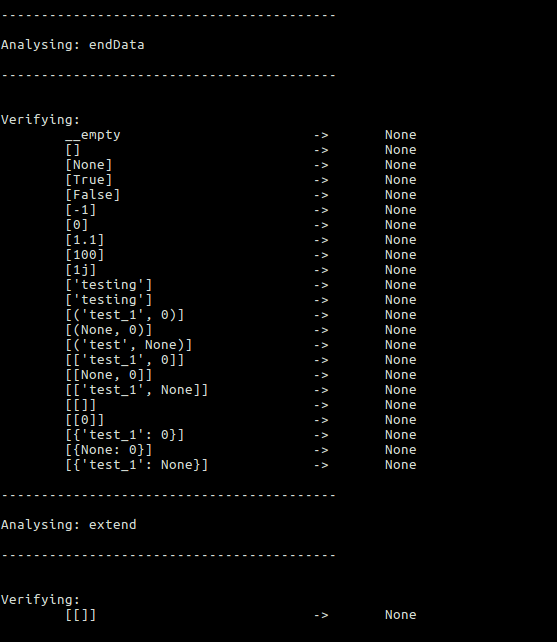

# Testing
------------------
Allows verification of python files and folders. <br > <br >
 

## Usage
```python test.py -l [project_folder] -ver 1 -val 1 -v 1```

## Functionality
1. Provide a folder and finds all the python files.
2. From these python files it takes all the modules.
<br > *Verification*<br >
3. Finds the arguments of these modules
4. Run these modules with different input to understand behavior
<br >*Validation*<br>
5. Makes checks for you if a folder with input, output is provided. By default uses the **Validation** folder it has.

## Extra
1. Allows input for domain based input, key words, or possible arguments for the methods.
2. Allows to check the process while running.
3. You can constrain the run_time for each of the processes.
4. Generate empty files for validation. 
5. Save all results of the processes in json and pdf. 

## Requirements
1. The code should not contain sys.exit() because that will terminate the process.
